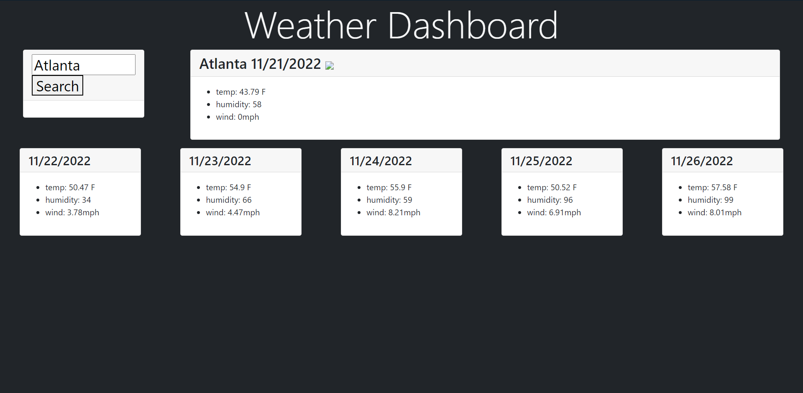

# Weather Dashboard

## Description

A weather forecast app that provides the date, tempurature, humidity, and windspeed for any city the user searches for.

## Usage

Type the name of a city into the search bar, then click the search button to see the five day forecast for that city. Recently searched cities will be put into a list and can be clicked to pull that cities forecast back up.

https://jnighton.github.io/weather-dashboard/

https://jNighton.github.io/

